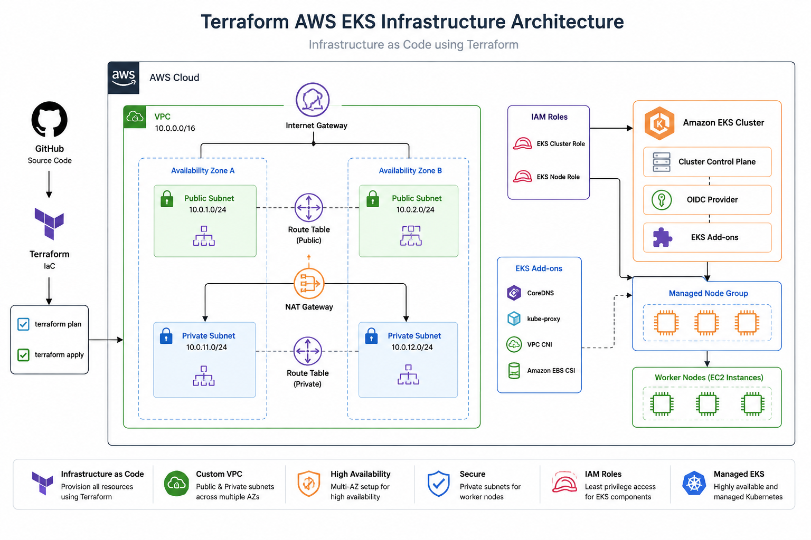
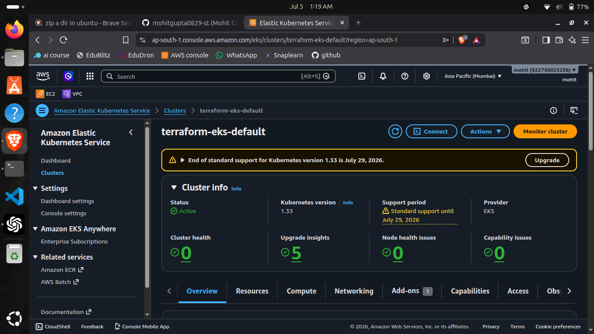
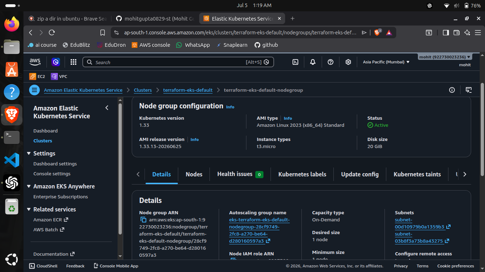
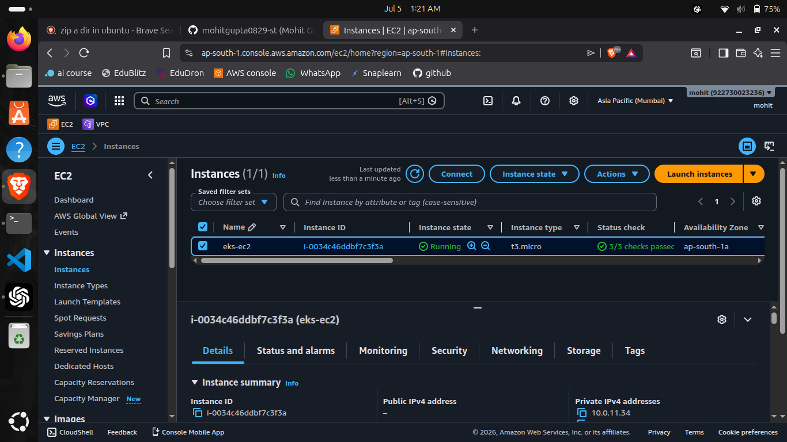
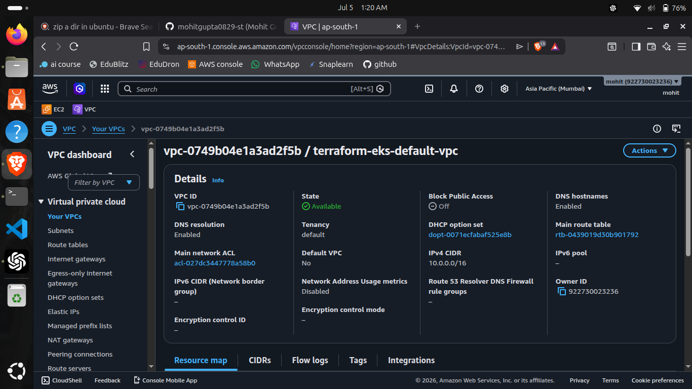
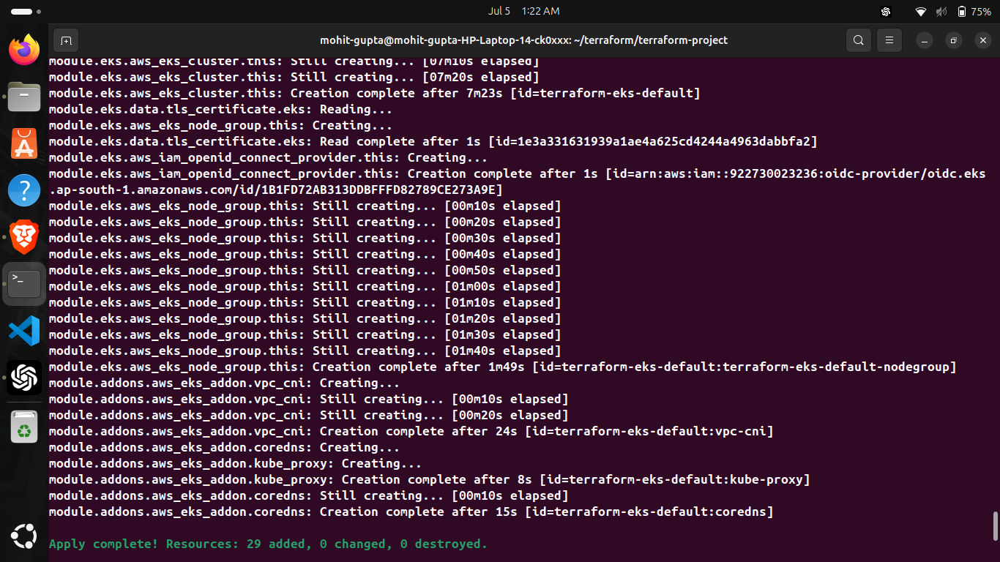
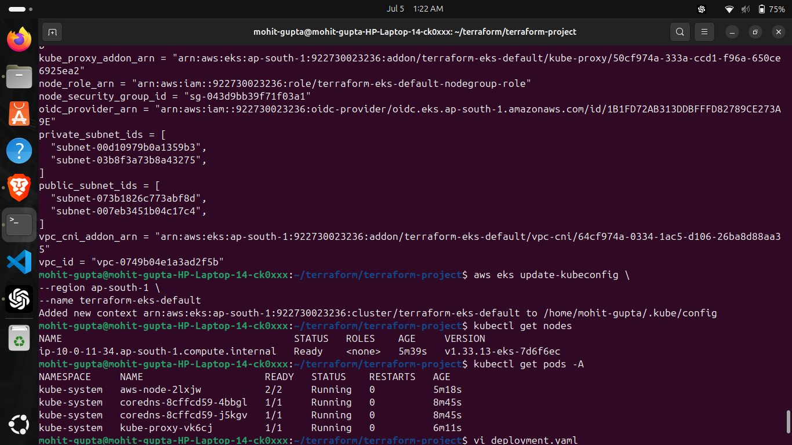

# 🚀 Production-Ready AWS EKS Infrastructure using Terraform 

Production-ready AWS EKS infrastructure built with Terraform using a modular architecture, multi-environment support, IAM, VPC, Managed Node Groups, and EKS Add-ons.

---

## 📌 Project Highlights

- Modular Terraform Architecture
- Multi-Environment Support (Development & Test)
- Terraform Workspaces
- Custom VPC
- Public & Private Subnets
- Internet Gateway
- NAT Gateway
- Route Tables
- IAM Roles
- Amazon EKS Cluster
- Managed Node Group
- OIDC Provider
- EKS Add-ons
- Outputs
- Environment Specific Variables

---
---
## 🏗️ Architecture

<p align="center">
  
</p>

```
GitHub
    │
    ▼
Terraform
    │
    ▼
AWS
    │
    ├── VPC
    │     ├── Public Subnets
    │     ├── Private Subnets
    │     ├── Internet Gateway
    │     ├── NAT Gateway
    │     └── Route Tables
    │
    ├── IAM
    │     ├── Cluster Role
    │     └── Node Role
    │
    └── Amazon EKS
          ├── Cluster
          ├── Managed Node Group
          ├── OIDC Provider
          └── Add-ons
```

---

## 📂 Project Structure

```text
terraform-aws-eks/
│
├── environments/
│   ├── development.tfvars
│   └── test.tfvars
│
├── modules/
│   ├── vpc/
│   ├── iam/
│   ├── eks/
│   └── addons/
│
├── provider.tf
├── versions.tf
├── backend.tf
├── locals.tf
├── main.tf
├── outputs.tf
├── terraform.tfvars
└── README.md
```
---

# 🛠️ Tech Stack

| Category | Technologies |
|----------|--------------|
| Infrastructure as Code | Terraform |
| Cloud Provider | AWS |
| Container Orchestration | Amazon EKS |
| Networking | Amazon VPC |
| Identity & Access | AWS IAM |
| Compute | Amazon EC2 |
| CLI Tools | AWS CLI, kubectl |
| Version Control | Git & GitHub |

---

# ☁️ AWS Services Used

- Amazon VPC
- Amazon EKS
- Amazon EC2
- IAM
- Internet Gateway
- NAT Gateway
- Route Tables
- Security Groups
- Elastic IP
- OIDC Provider

---

# ⚙️ Terraform Concepts Covered

- Terraform Modules
- Variables
- Outputs
- Locals
- Data Sources
- Terraform Workspaces
- Resource Dependencies
- for_each
- count
- Validation
- Dynamic Infrastructure
- Environment Specific Configuration

---

# 🚀 Deployment

### Clone Repository

```bash
git clone <repository-url>

cd terraform-aws-eks
```

### Initialize Terraform

```bash
terraform init
```

### Select Workspace

```bash
terraform workspace select development
```

or

```bash
terraform workspace select test
```

### Plan

```bash
terraform plan \
-var-file="terraform.tfvars" \
-var-file="environments/development.tfvars"
```

### Apply

```bash
terraform apply
```

### Configure kubectl

```bash
aws eks update-kubeconfig \
--region ap-south-1 \
--name <cluster-name>
```

### Verify Cluster

```bash
kubectl get nodes

kubectl get pods -A
```   

# 📸 Project Screenshots

## Amazon EKS Cluster



---

## Managed Node Group



---

## Worker Node



---

## VPC Architecture



---

## Terraform Apply



---

## Kubernetes Nodes



---

# ✨ Key Features

- Production-style modular Terraform project
- Multi-environment deployment using Terraform Workspaces
- Reusable modules for VPC, IAM, EKS, and Add-ons
- Private networking with Public & Private Subnets
- Managed EKS Node Groups
- OIDC integration for secure IAM authentication
- Environment-specific configuration using `.tfvars`
- Infrastructure validation with `terraform fmt`, `validate`, and `plan`
- Clean project structure following Infrastructure as Code best practices

---

# 📚 What I Learned

Through this project, I gained hands-on experience with:

- Designing reusable Terraform modules
- Building AWS networking from scratch
- Creating and managing Amazon EKS clusters
- Configuring IAM Roles and OIDC
- Managing Terraform Workspaces
- Deploying infrastructure across multiple environments
- Managing Kubernetes clusters using `kubectl`
- Debugging real-world infrastructure deployment issues
- Following Infrastructure as Code best practices

---

# 📈 Future Improvements

- Remote Backend (Amazon S3 + DynamoDB)
- GitHub Actions for Infrastructure Deployment
- Helm Provider Integration
- AWS Load Balancer Controller
- Cluster Autoscaler
- Metrics Server
- Prometheus & Grafana Monitoring
- Sample Three-Tier Application Deployment

---

# 📋 Project Workflow

```text
Terraform Code
        │
        ▼
terraform init
        │
        ▼
terraform validate
        │
        ▼
terraform plan
        │
        ▼
terraform apply
        │
        ▼
AWS Infrastructure
        │
        ▼
Amazon EKS Cluster
        │
        ▼
kubectl
        │
        ▼
Deploy Applications
```

---

# 👨‍💻 Author

**Mohit Gupta**

- Final Year BCA-MCA Student
- DevOps & Cloud Enthusiast
- Passionate about AWS, Kubernetes, Terraform, Docker, and CI/CD

GitHub: https://github.com/mohitgupta0829-st

LinkedIn: www.linkedin.com/in/mohitgupta-dev28

---

# ⭐ Support

If you found this project helpful, consider giving it a ⭐ on GitHub.

---
